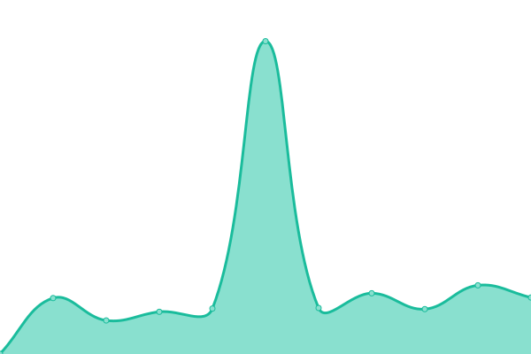

# [📈 Live Status](https://status.melangebox.com): <!--live status--> **🟩 All systems operational**

This repository contains the open-source uptime monitor and status page for [Melangebox](https://melangebox.com), powered by [Upptime](https://github.com/upptime/upptime).

With [Upptime](https://upptime.js.org), you can get your own unlimited and free uptime monitor and status page, powered entirely by a GitHub repository. We use [Issues](https://github.com/Melangebox/status/issues) as incident reports, [Actions](https://github.com/Melangebox/status/actions) as uptime monitors, and [Pages](https://status.melangebox.com) for the status page.

<!--start: status pages-->
<!-- This summary is generated by Upptime (https://github.com/upptime/upptime) -->
<!-- Do not edit this manually, your changes will be overwritten -->

| URL                                  | Status | History                                                                                      | Response Time                                                                   | Uptime                                                                                                                                                                                                             |
| ------------------------------------ | ------ | -------------------------------------------------------------------------------------------- | ------------------------------------------------------------------------------- | ------------------------------------------------------------------------------------------------------------------------------------------------------------------------------------------------------------------ |
| [Melangebox](https://melangebox.com) | 🟩 Up  | [melangebox.yml](https://github.com/Melangebox/status/commits/master/history/melangebox.yml) |  660ms |  |

<!--end: status pages-->

[**Visit our status website →**](https://status.melangebox.com)

## 📄 License

- Code: [MIT](./LICENSE) © [Melangebox](https://melangebox.com)
- Data in the `./history` directory: [Open Database License](https://opendatacommons.org/licenses/odbl/1-0/)
<!-- start: readme-repos-list -->
<!-- This list is auto-generated using koj-co/readme-repos-list -->
<!-- Do not edit this list manually, your changes will be overwritten -->

<!-- end: readme-repos-list -->undefined